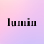

<p align="center">
  
</p>

<h1 align="center">Lumin — AI Glow Up</h1>

<p align="center">
  <strong>Your AI-powered personal beauty & style companion.</strong>
</p>

<p align="center">
  <a href="#features">Features</a> •
  <a href="#screenshots">Screenshots</a> •
  <a href="#tech-stack">Tech Stack</a> •
  <a href="#getting-started">Getting Started</a> •
  <a href="#project-structure">Project Structure</a> •
  <a href="#contributing">Contributing</a> •
  <a href="#license">License</a>
</p>

<p align="center">
  
  
  
  
</p>

---

## Overview

**Lumin** is a cross-platform mobile application that leverages artificial intelligence to help users discover their best look. From AI-driven skin and hair analysis to virtual try-on and personalised style recommendations, Lumin is the all-in-one glow-up toolkit built for the modern era.

## Features

| Feature                    | Description                                                                 |
| -------------------------- | --------------------------------------------------------------------------- |
| 🧠 **Ask Lumin (AI Chat)** | Conversational AI assistant for personalised beauty & style advice          |
| 🪞 **Face Analysis**       | AI-powered facial feature analysis with tailored recommendations            |
| 💇 **Hair Analysis**       | Detailed hair type detection and care routine suggestions                   |
| 🧴 **Skin Analysis**       | Skin condition assessment with product & routine guidance                   |
| 👗 **Virtual Try-On**      | Camera-based virtual try-on for outfits and accessories                     |
| 🛍️ **Smart Shopping**      | Curated product recommendations with bag & wishlist management              |
| 🎨 **Style Profiling**     | Multi-step onboarding that captures work, casual, and night-out preferences |
| 🌙 **Animated Splash**     | Premium animated splash screen with smooth transition                       |

## Screenshots

> _Coming soon — screenshots and demo GIFs will be added here._

## Tech Stack

| Layer          | Technology                                                                                                             |
| -------------- | ---------------------------------------------------------------------------------------------------------------------- |
| **Framework**  | [React Native](https://reactnative.dev/) 0.81                                                                          |
| **Platform**   | [Expo](https://expo.dev/) SDK 54 (Expo Router v6)                                                                      |
| **Language**   | [TypeScript](https://www.typescriptlang.org/) 5.9                                                                      |
| **Navigation** | [React Navigation](https://reactnavigation.org/) 7 (Bottom Tabs + Native Stack)                                        |
| **Animations** | [React Native Reanimated](https://docs.swmansion.com/react-native-reanimated/) 4 · [Lottie](https://airbnb.io/lottie/) |
| **UI**         | Expo Linear Gradient · Expo Blur · Lucide Icons                                                                        |
| **Media**      | Expo Camera · Expo Image Picker · Expo Video                                                                           |
| **Networking** | React Native URL Polyfill · Cross-Fetch                                                                                |

## Getting Started

### Prerequisites

- **Node.js** ≥ 18 — [Download](https://nodejs.org/)
- **Expo CLI** — installed globally or via `npx`
- A physical device with **Expo Go**, or an Android / iOS emulator

### Installation

```bash
# 1. Clone the repository
git clone https://github.com/sandeepannandi/Lumin.git
cd Lumin

# 2. Install dependencies
npm install

# 3. Start the development server
npx expo start
```

Scan the QR code with **Expo Go** (Android / iOS) or press `a` / `i` to launch an emulator.

### Available Scripts

| Command             | Description                                    |
| ------------------- | ---------------------------------------------- |
| `npx expo start`    | Start the Expo development server              |
| `npm run android`   | Build & run on an Android device / emulator    |
| `npm run ios`       | Build & run on an iOS simulator _(macOS only)_ |
| `npm run lint`      | Run the project linter                         |
| `npm run build:web` | Export a production web bundle                 |

## Project Structure

```
lumin/
├── app/                        # Expo Router screens
│   ├── _layout.tsx             # Root layout & navigation config
│   ├── home.tsx                # Home / dashboard screen
│   ├── ask-lumin.tsx           # AI chat assistant
│   ├── skin.tsx                # Skin analysis module
│   ├── hair.tsx                # Hair analysis module
│   ├── virtual-tryon.tsx       # Virtual try-on camera screen
│   ├── profile.tsx             # User profile
│   ├── settings.tsx            # App settings
│   ├── bag-checkout.tsx        # Shopping bag & checkout
│   ├── wishlist.tsx            # Saved / wishlist items
│   ├── orders.tsx              # Order history
│   └── chat-history.tsx        # Past AI conversations
├── components/                 # Reusable UI components
│   ├── AnimatedSplashScreen.tsx
│   ├── FaceAnalysisScreen.tsx
│   ├── LoginScreen.tsx
│   ├── OnboardingCarousel.tsx
│   ├── UserDetailsScreen.tsx
│   ├── BodyDetailsScreen.tsx
│   └── *PreferenceScreen.tsx   # Style-preference onboarding steps
├── hooks/                      # Custom React hooks
├── assets/                     # Images, icons & media
├── app.json                    # Expo configuration
├── package.json
└── tsconfig.json
```

## Contributing

Contributions are welcome! Please follow these steps:

1. **Fork** the repository.
2. **Create** a feature branch: `git checkout -b feature/amazing-feature`.
3. **Commit** your changes: `git commit -m "feat: add amazing feature"`.
4. **Push** to the branch: `git push origin feature/amazing-feature`.
5. **Open** a Pull Request.

> For major changes, please open an issue first to discuss the proposed modification.

## License

This project is licensed under the **Apache License 2.0** — see the [LICENSE](LICENSE) file for details.

---

<p align="center">
  Built with ❤️ by <a href="https://github.com/sandeepannandi">Sandeepan Nandi</a>
</p>
